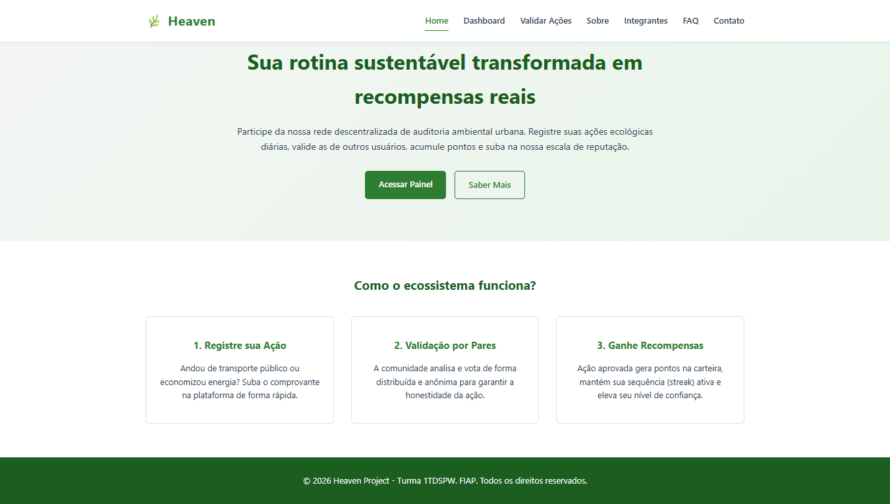
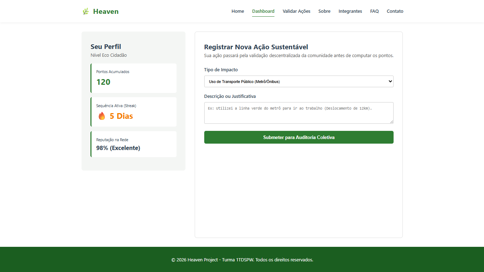
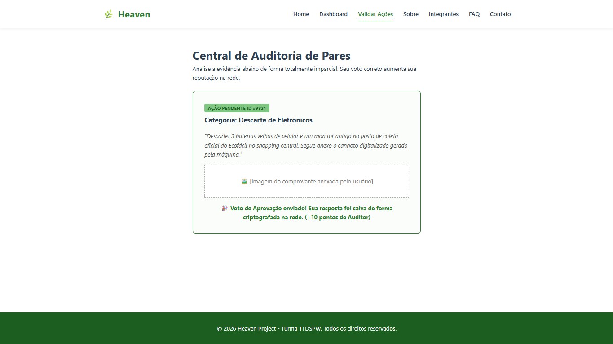
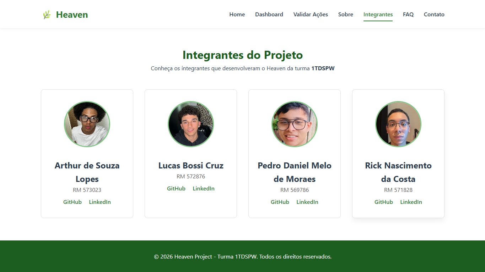

# 🌿 Heaven

---

## 📋 Descrição do Projeto

O **Heaven** é uma plataforma digital voltada para o monitoramento, centralização e validação de ações sustentáveis e de conformidade ambiental.

Seu principal objetivo é permitir que usuários e instituições acompanhem métricas ecológicas, validem atividades ambientais e tomem decisões mais conscientes com base em dados organizados em um ecossistema intuitivo, moderno e responsivo.

A proposta do sistema busca unir **tecnologia, acessibilidade e sustentabilidade**, oferecendo uma experiência visual limpa e funcional.

---

## 🛠️ Tecnologias Utilizadas

O desenvolvimento front-end do projeto foi realizado utilizando tecnologias nativas e modernas.

### Estrutura e Desenvolvimento
- **HTML5** → Estruturação semântica da aplicação.
- **CSS3** → Estilização visual, responsividade e organização do layout.
- **JavaScript (Vanilla JS)** → Manipulação do DOM, interações dinâmicas e lógica da aplicação.

### Recursos Aplicados
- CSS Grid
- Flexbox
- Variáveis CSS globais
- Responsividade mobile-first
- Menu hambúrguer responsivo
- Validação de formulários
- Simulação de auditoria descentralizada
- Organização modular de scripts

---

## 📂 Estrutura de Pastas do Projeto

```text
Heaven/
│
├── index.html                  # Página inicial (Home)
├── README.md                   # Documentação do projeto
│
├── css/
│   └── style.css               # Estilos globais da aplicação
│
├── js/
│   ├── main.js                 # Funcionalidades gerais e menu responsivo
│   ├── interacoes.js           # Scripts de interações da plataforma
│   └── validacao.js            # Fluxo de auditoria e validações
│
├── img/                        # Imagens e identidade visual
│   ├── eu lindo.png
│   ├── Image.jfif
│   ├── Image(rick).jfif
│   └── nielda.webp
│
└── paginas/
    ├── contato.html
    ├── faq.html
    ├── integrantes.html
    ├── sobre.html
    ├── solucao-dashboard.html
    └── solucao-validar.html
```

---

## ⚙️ Funcionalidades do Sistema

O projeto Heaven conta com as seguintes funcionalidades:

- Página inicial institucional
- Dashboard de métricas ecológicas
- Simulação de auditoria descentralizada
- Aprovação e rejeição de ações ambientais
- Sistema de feedback visual
- Menu responsivo mobile
- Formulário com validação estruturada
- Área FAQ
- Página da equipe
- Layout totalmente responsivo

---

## 🖼️ Representação Visual do Projeto

### Página Inicial
Print da Home


### Dashboard
Print do Dashboard


### Tela de Auditoria / Validação
Print da tela de auditoria


### Página da Equipe
Print da página de integrantes


## 👨‍💻 Autores e Créditos

### Arthur Souza
- **RM:** 573023  
- **Turma:** 1TDSPW  
- **GitHub:** <a href="https://github.com/arthurlopes2007"></a>  
- **LinkedIn:** <a href="https://www.linkedin.com/in/arthur-souza-lopes-037112346/"></a>

---

### Lucas Bossi
- **RM:** 572876  
- **Turma:** 1TDSPW  
- **GitHub:** <a href="https://github.com/bsscrz"></a>  
- **LinkedIn:** <a href="https://www.linkedin.com/in/lucas-bossi-1a54443a3/"></a>

---

### Pedro Moraes
- **RM:** 569786  
- **Turma:** 1TDSPW  
- **GitHub:** <a href="https://github.com/PedroDaniel7"></a>  
- **LinkedIn:** <a href="https://www.linkedin.com/in/pedrodanielmoraes/"></a>

---

### Rick Nascimento
- **RM:** 571828  
- **Turma:** 1TDSPW  
- **GitHub:** <a href="https://github.com/rcostaa-dev"></a>  
- **LinkedIn:** <a href="https://www.linkedin.com/in/rick-nascimento-b063733b6/"></a>

---

## 🔗 Repositório Oficial

GitHub do projeto:
<a href="https://github.com/bsscrz/Heaven"></a>

---

## 🌐 Link do Site / Deploy
<a href="https://bsscrz.github.io/Heaven/"></a>

---

## 📞 Contato / Suporte

Caso tenha alguma dúvida, sugestões ou queira contribuir com o projeto:

📧 E-mail´s:
    arthurdesouzalopes635@gmail.com
    lucabossicruz@gmail.com
    pedrodaniel.mmoraes@gmail.com
    rickgodinhotk7@gmail.com

Ou entre em contato pelos perfis GitHub e LinkedIn dos integrantes.

---

## 📚 Créditos Acadêmicos

Projeto desenvolvido para fins acadêmicos na disciplina de desenvolvimento web da turma **1TDSPW**, com foco em:

- Estruturação semântica HTML
- Responsividade
- Organização de arquivos
- Manipulação de DOM
- JavaScript puro
- Interface intuitiva
- Sustentabilidade aplicada à tecnologia

---

## 💾 Commits
**Lucas Bossi Cruz**
1-core: definicao da arquitetura de pastas e criacao do readme informativo
2-core: configuracao da paleta de cores globais e reset de estilos no css
17-feat: imagens adicionadas dentro de contato e integrantes.
19-feat: Readme re-criado, e prints adicionados.
20-feat: Readme atualizdo.
21-feat: Link para o site adicionado ✅

**Arthur de Souza Lopes**
5-feat: implementacao do menu responsivo hamburguer em javascript
6-feat: criação da pagina de validacao em javascript
11-feat: criação das interações
15-feat: index atualizado, contato estava errado
16-feat: Alterações feitas dentro do Contato e Integrantes.html, emails e numeros adicionados

**Pedro Daniel Melo de Moraes**
8-feat: criacao da pagina faq
9-feat: criação da solução-dashboard
10-feat: criacao da pagina solucao-validar
14-feat: alterações feitas nos HTML
18-feat: ALterações de equipe para integrantes.

**Rick Nascimento da Costa**
3-feat: estruturacao semantica da pagina inicial integrantes.html
4-feat: criacao da pagina de integrantes com dados e links obrigatorios
7-feat: criação da pagina sobre
12-feat: Alterações e remoções feitas para cada arquivo
13-feat: contato re-adicionado

## © Licença

Projeto acadêmico de uso educacional.
Todos os direitos reservados aos integrantes da equipe **Heaven**.